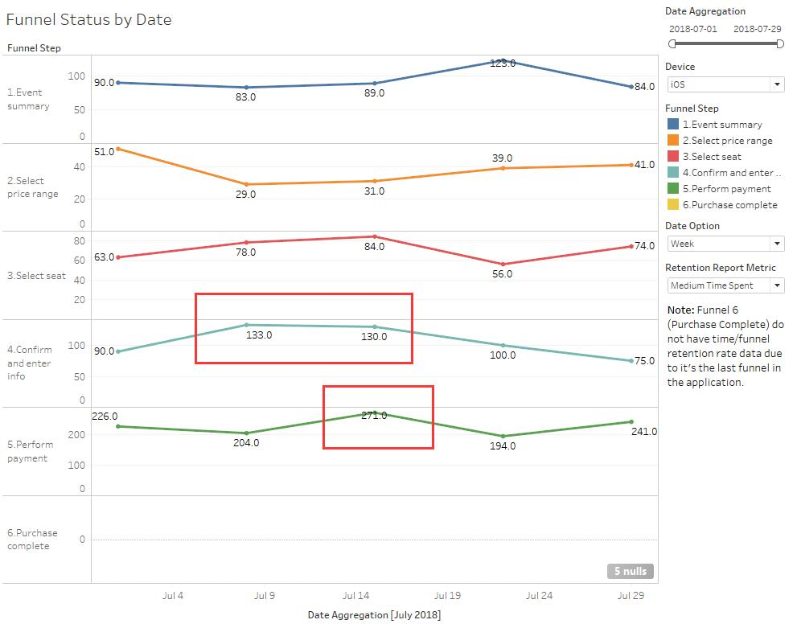
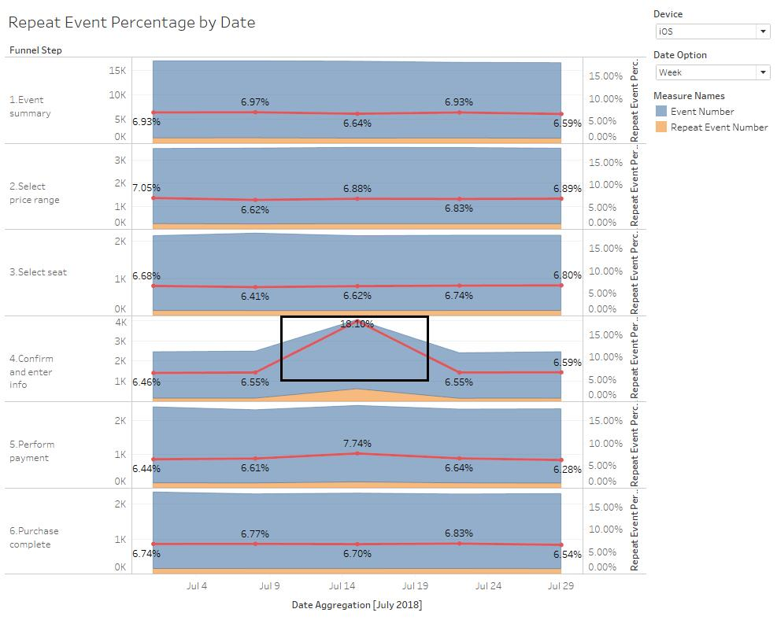

## Setup Instruction<br>

### 1. MySQL<br>
All query used in anwsers are using MySQL database, click [here](https://dev.mysql.com/downloads/mysql/) to download MySQL community server (8.0.12):<br>
<br>
Select respective OS version before download.<br><br>

### 2. Python 3.x<br>
#### Python Installation<br>
For Q2, python 3.x is needed, please download under respective OS [here](https://www.python.org/downloads/). <br>

<b>Note:</b> Select `Custom Install` and make sure you include `pip` during installation process for python library setup.<br>
<br>
For macOS, if [Homebrew](https://brew.sh/) is already installed in your computer, you may use below command instead of installer to setup python 3.x:<br>
```brew install python```<br>
#### Python Library Setup<br>
Only python library needed to install for question 2 is [pandas](https://pandas.pydata.org/)<br> 
Use command below in command line for pandas installation:<br>
```pip install pandas```<br>
If multiple version of python installed in your computer, please use command line below instead:<br>
```pip3 install pandas```<br><br>

### 3. Tableau<br>
For Question 4, visulizations are created with Tableau Desktop, click [here](https://www.tableau.com/products/desktop/download) to download & use trial version if no paid account available.<br>

## Anwsers

### Question 1<br>
Open folder `Q1`, run MySQL query `Q1.sql` under database scheme with `piwik_track` table.

### Question 2<br>
(1) Open `Q2` folder, replace `Q2.tsv` with actual data or directly use this sample data in the folder.<br>
(2) Run `Q2.py` (change the `file_path` variable if `Q2.tsv` is not in same folder)<br> 
The printed result will include: top 10 raw data, top 10 filtered data (JPEG file access between 2017-08-24 to 2017-08-25)<br>
and total file size of filtered data, under sample data it will be:<br> 
```Total JPEG file size transfered from 2017-08-24 to 2017-08-25 : 83.25 KB```<br>

### Question 3<br>
Open `Q3` folder, load the data set into MySQL server with `Q3_data.sql`, it will create a table named as 'q3' with data provided by the GNU file. <br>
#### Question 3a<br>
Run Q3a.sql against q3 table, you will get 3 query results:<br>
Result 1 anwsering first 3 questions: <br>
(1) In total there are 357912 number of visits. <br>
(2) There are 64265 number of distinct users. <br>
(3) There are 15613 number of distinct pages. <br>
Result 2 anwsering next two questions: <br>
(4) 04:00:00 - 04:59:59 gives smallest number of visits: 1577 <br>
(5) 12:00:00 - 12:59:59 give largest number of visits: 30920 <br>
#### Question 3b<br>
Open `Q3b.html` to check all four data plots created with [Datawrapper](https://www.datawrapper.de/).<br>
Run `Q3b.sql` to check how did I get the raw data for each of the data plots.<br>

### Question 4<br>
#### Key questions for performance of the application: <br>
Since it's product KPI as stated in question, I'll be focusing on product design & stability rather than marketing related issue (which will also be per event rather than per product).<br>
Does the application UI clear & easy for user to proceed?<br>
Does the application running smoothly in everystep? <br>
Is the landing page design (event summary) engaging? <br>
<br>
#### Tracking Plan
<b>Assumption & metrics needed:</b><br>
For question 1, assuming the UI design is clear and provide enough info for user, there should be:<br>
(1) High <b>retention rate</b> (need to track <b>button click success</b> between each step)<br>
(2) Less <b>time spent</b> between funnel (need <b>event trigger time</b>) <br>
<br>
For question 2, in addition to internal error report we have, any low loading time or un-detected error will highly likelly to cause user to <b>retry clicking</b> on same action/step, also resulting longer time spent between funnel. (need all meaningful actions & trigger time within each funnel, calculate repeat event if an event with same property as previous one happens within 30 secs) <br>
<br>
For question 3, during whole purchase funnel, event summary is the step including most effective info & affecting user's initial purchase intention. How close the user <b>viewed down to `Purchase Ticket`</b> and where did they drop off will indicate the performance. However, it can be either a design (product) issue or content (marketing) issue, to separate out it would be better used in A/B testing rather than standalone. (Need deepest <b>view depth</b> user slided down and stayed more than 5 seconds)<br>
<br>
<b>In summary, the tracking plan needed will be:</b> <br>
	(1) Event summary: Deepest percentage of page each user slided down & staying more than 5 seconds (view depth) & purchase button click;<br>
	(2) Select price range: Price range selected;<br>
	(3) Select seat: Seat selected, seat cancelled (both with seat number if possible) & seat confirmed; <br>
	(4) Confirm & enter info: click on each input field & pay now button clicked; <br>
	(5) Perform payment: Payment complete & redirect to next page; <br>
	(6) Purchase complete: Purchase complete time. <br>
	For all events above, trigger time, device type, user/device id should be included as common property.<br>

#### Reporting
Open folder `Q4`, and use tableau desktop to open `Q4.twb`. Sample data are generated with excel in Q4_data.xlsx.<br>
4 Reports are created base on above data anwsering each question.<br>

For question 1 will be `Overall Funnel Retention` showing aggregated retention rate for each funnel to compare across funnel;
.<br>
In sample data, it indicates overall funnel 1 will be the bottleneck of overall purchase funnel.
<br>

<br>and `Funnel Status by Date` showing each funnel's retention/time spent within funnel across date to check if there is any obvious fluctuation<br>.<br>

As in above picture, there is obvious performance drop on funnel 4, indicating low performance if for application version on respective period. Same for funnel 5, indicating third party vendor on payment loading much slower <br><br>

Question 2 will be `Repeat Event Percentage`, calculating number of repeat event percentage of all events<br>
.<br>
Here it shows on July-14th to July-21th, user triggering same event repetitively much more than usual while submiting info.

Question 3 will be `Event Summary Performance Report`, specifically showing view depth distribution (in histogram) and Event Summary page's conversion rate by date<br>
.<br>
Sample report showing comparing with early July, later version attracting user to slide down and staying much deeper (higher level + positive skewness), resulting a better conversion rate.<br>
	
